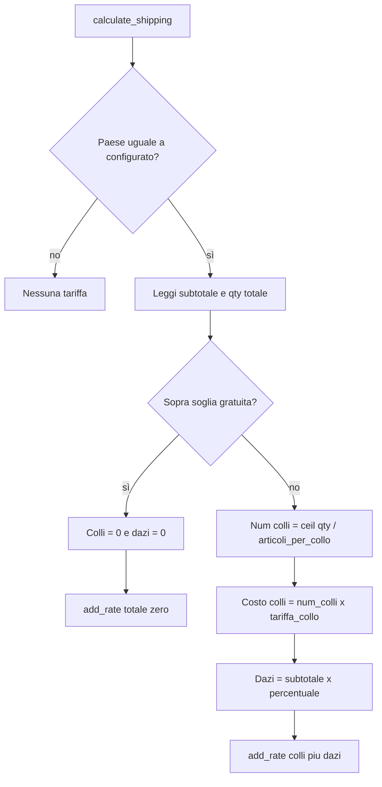

# Piano: plugin spedizione a colli e dazi (WooCommerce)

Backup della pianificazione (allineato al piano Cursor). Requisiti originali: [docs.md](./docs.md).

## Contesto

I requisiti sono definiti in [docs.md](./docs.md). La cartella del plugin può contenere solo documentazione iniziale: si tratta di **implementazione greenfield** (bootstrap plugin + classi PHP).

## Comportamento funzionale (da codificare)

| Elemento                      | Valore di default (esempio da docs) | Configurabile                 |
| ----------------------------- | ----------------------------------- | ----------------------------- |
| Paese ammesso                 | Una nazione                         | Sì (select paesi WooCommerce) |
| Spedizione gratuita           | Ordine ≥ 1500 €                     | Sì (soglia)                   |
| Sotto soglia: costo per collo | 170 €                               | Sì                            |
| Sotto soglia: dazi            | 15% sul valore ordine               | Sì (%)                        |
| Capacità collo                | ~20 unità (cappelli)                | Sì (intero ≥ 1)               |

**Logica colli:** quantità totale di unità nel carrello (somma delle `quantity` delle righe) diviso capacità collo, **arrotondamento per eccesso** → numero di colli. Costo spedizione = `numero_colli × costo_per_collo`.

**Base dazi (solo se la spedizione non è gratuita):** usare il **subtotale carrello** coerente con WooCommerce (tipicamente dopo sconti, prima di spedizione; allinearsi a `WC_Cart::get_subtotal()` nel contesto `calculate_shipping`, documentando la scelta nel codice). **Regola esplicita (chiarimento requisito):** la percentuale dazi viene **sempre** applicata al subtotale **solo quando** l’ordine è **sotto** la soglia di spedizione gratuita; se la spedizione è gratuita (ordine ≥ soglia), **non** si applicano dazi (importo dazi = 0). Importo dazi = `subtotale × (percentuale / 100)` solo in quel caso.

**Visibilità del metodo:** il metodo è applicabile solo se il paese di destinazione del pacco spedizione coincide con la nazione configurata (confronto con `country` nel `$package` passato a `calculate_shipping`).

## Architettura modulare (file suggeriti)

Struttura proposta sotto la root del plugin (max ~300–400 righe per file, separazione responsabilità):

1. **`woo-package-shipping.php`** (file principale)
   - Header plugin WordPress (nome, versione, dipendenza WooCommerce).
   - Controllo `ABSPATH`, verifica che WooCommerce sia attivo (`class_exists( 'WooCommerce' )` o hook `before_woocommerce_init` se serve HPOS-compat).
   - Autoload semplice (`require_once` ordinato) o PSR-4 minimo solo se si preferisce namespace.
   - Hook `plugins_loaded` / `woocommerce_shipping_init` per registrare la classe shipping.

2. **`includes/class-wc-shipping-package-duties.php`** (o nome analogo)
   - Estende `WC_Shipping_Method`.
   - `id`, `method_title`, `method_description`, `supports`.
   - `init_form_fields()` / `init_settings()` con campi: titolo metodo, nazione, soglia spedizione gratuita, costo per collo, articoli per collo, percentuale dazi, eventuale “tax status” se si espone come costo tassabile (decisione: di solito spedizione e fee possono seguire le impostazioni WC).
   - `is_available( $package )`: disponibile solo se paese corrisponde e metodo abilitato.
   - `calculate_shipping( $package )`: calcolo colli + dazi, aggiunta `add_rate()` con costo totale (spedizione + dazi) o **due rate separate** se si vuole trasparenza in checkout (consigliato: **un’unica tariffa** con `label` descrittivo o meta, per semplicità; in alternativa due `add_rate` con etichette “Spedizione” e “Dazi”).

3. **`includes/class-package-shipping-calculator.php`** (logica pura, testabile)
   - Metodi statici o istanza: `count_packages( int $total_qty, int $items_per_package ): int`, `compute_shipping_cost( int $packages, float $per_package ): float`, `compute_duties( float $subtotal, float $percent, bool $shipping_is_free ): float` (restituisce 0 se spedizione gratuita), `should_free_shipping( float $subtotal, float $threshold ): bool`.
   - Nessuna dipendenza diretta da `$_POST`; input già validati.

4. **`readme.txt`** (opzionale ma standard repository WordPress.org) — solo se si desidera distribuzione.

**Nessun file JS obbligatorio** se tutto passa dalle impostazioni native del metodo di spedizione in **WooCommerce → Impostazioni → Spedizione → Zone**.

## Integrazione WooCommerce

- Registrazione: filtro `woocommerce_shipping_methods` → aggiungere la classe.
- Istanza del metodo viene creata da WC quando si aggiunge il metodo a una zona; l’amministratore sceglie la **zona** (es. “Italia”) e aggiunge questo metodo — la **nazione nel form** del metodo funge da vincolo aggiuntivo sul `$package['destination']['country']` per evitare errori se la zona includesse più paesi (doppio controllo: zona WC + paese impostato nel metodo).

## Sicurezza e affidabilità

- Opzioni salvate con API WooCommerce (`$this->get_option` / `update_option` tramite parent): escaping in output (`esc_html` dove serve).
- Validazione in `process_admin_options()` o `sanitize_option`: soglia e importi ≥ 0, percentuale 0–100, articoli per collo intero ≥ 1, codice paese `sanitize_text_field` + whitelist `WC()->countries->get_countries()`.
- Nessuna esecuzione di input utente come codice; nessun endpoint AJAX custom se non necessario.

## Test manuali (checklist)

- Carrello sotto soglia, 1–20 qty → 1 collo; 21 qty → 2 colli; **dazi = subtotale × %** (sempre quando si paga la spedizione).
- Carrello sopra soglia → **costo colli = 0 e dazi = 0** (spedizione gratuita nel senso completo per questo metodo: nessun addebito colli né dazi).

## Diagramma flusso calcolo

## Ordine di implementazione consigliato

1. File principale plugin + attivazione sicura con WooCommerce.
2. Classe `Calculator` con unit test opzionale (PHPUnit) o almeno assert manuali in commenti/esempi.
3. Classe `WC_Shipping_Method` con form fields e salvataggio.
4. `calculate_shipping` + `is_available`.
5. Test su checkout con zone diverse e quantità limite (19, 20, 21 articoli).

## Requisito dazi (confermato)

- Sotto soglia: **sempre** applicare la percentuale dazi sul subtotale (nessuna eccezione oltre a validazione numerica).
- Sopra soglia (spedizione gratuita): **nessun** addebito dazi.
